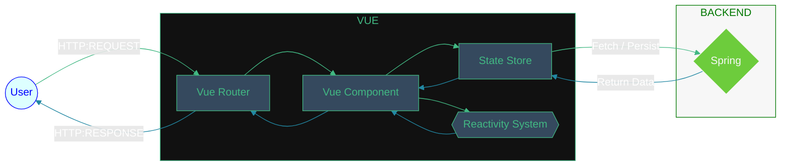
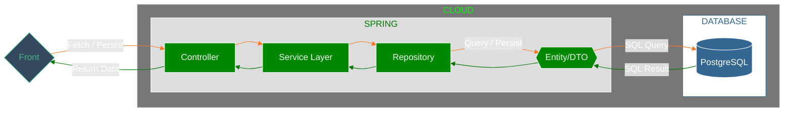

<h1 align="center">
   
  Finance Control
</h1>

Já aconteceu de dia 5 ou dia 15 acordar felizão com o salário na conta e não ter ideia de onde foi cada centavo dois dias depois? Aqui é onde o Finance Control entra em ação! Com ele você consegue controlar suas finanças - literalmente - rastreando onde vai cada real através de transações cadastradas na plataforma: coloque o dia que seu salário caiu, registre cada compra ou investimento que fizer e tenha de forma visível o seu fluxo de caixa, simples como torrar todo o seu dinheiro...

## Stack

<!--  -->
<!--  -->

<!--  -->

<!--  -->
<!--  -->
<!--  -->
<!--  -->
<!--  -->
<!--  -->
<!--  -->

<!--  -->
<!--  -->

## Arquitetura

A arquitetura escolhida para o projeto quanto à nivel de repositório foi a de "monorepo", onde o projeto se divide em duas ou mais estruturas (diretórios) diferentes mas dentro do mesmo repositório. É possível observar os diretórios `backend/` e `frontend/` dentro deste repositório, e isso caracteriza a estrutura monorepo.

### Front-End

Quanto ao diretório `frontend/` a escolha - deveras polêmica, com manipulação de votação - foi o Vue, que é um framework progressivo para construção de interfaces web reativas. Sua arquitetura é baseada no padrão MVVM (Model-View-ViewModel), promovendo separação de responsabilidades e reatividade declarativa.

A View é definida com templates baseados em HTML, que são compilados em funções de renderização. O ViewModel, representado pela instância Vue, atua como intermediário entre a View e o Model, expondo dados reativos e manipulando eventos.

A reatividade é garantida por um sistema de observação eficiente, baseado em proxies (Vue 3) ou Object.defineProperty (Vue 2), que rastreia dependências e propaga mudanças automaticamente para a UI.

A arquitetura é modular: componentes Vue encapsulam template, lógica e estilo, promovendo reutilização. O Vue Router gerencia navegação entre views, e o Pinia (ou Vuex, em versões anteriores) oferece gerenciamento de estado global previsível.

O build é orientado por ferramentas modernas como Vite ou Webpack, com suporte a TypeScript, SSR (via Nuxt.js), e integração com REST/GraphQL.

### Back-End

A nível de projeto, o diretório `backend/` apresenta a estrutura padrão do Spring com Java; O Spring é um framework modular e extensível, amplamente utilizado no desenvolvimento de aplicações Java corporativas. Sua arquitetura é baseada em princípios como Inversão de Controle (IoC), Injeção de Dependência (DI) e Programação Orientada a Aspectos (AOP), promovendo alta coesão, baixo acoplamento e fácil testabilidade.

O núcleo da arquitetura é o Spring Core Container, responsável por gerenciar o ciclo de vida dos beans (componentes da aplicação), configurados via anotações ou arquivos XML. O contêiner utiliza o ApplicationContext para carregar definições de beans e prover serviços como internacionalização, propagação de eventos e acesso a recursos.

A camada de acesso a dados é abstraída pelo módulo Spring Data, que se integra facilmente com JPA, JDBC e bancos NoSQL. O uso de repositórios permite encapsular regras de persistência com interfaces, eliminando grande parte do boilerplate code.

## Execução

Antes de iniciar com o desenvolvimento e os comandos, é importante definir as variáveis de ambiente no seu ambiente de desenvolvimento. Abaixo a listagem de quais definir:

| Variável  | Tipo     | Necessidade            | Default | Descrição                  |
| :-------- | :------- | :--------------------- | :------ | :------------------------- |
| `EXAMPLE` | `string` | [Required \| Optional] | `Foo`   | Lorem ipsum dolor sit amet |

### Front-End

<!--
LISTA DE POSSÍVEIS AÇÕES

Linter
Checagem de Tipos
Conversão (e.g. TS -> JS)
Buscar/iniciar Migrações (Atualizações) de Banco de Dados
Atualizar Estrutura do Banco de Dados com Novas Migrações
Iniciar Testes Automatizados
Popular Banco de Dados para Execução Local
Iniciar o Servidor
 -->

#### Ação

`comando`

### Back-End

#### Ação

`comando`

## To-Do List

- [ ] Lista
- [ ] de
- [ ] Tarefas

## Licença

This project is under [MIT - Massachusetts Institute of Technology](https://choosealicense.com/licenses/mit/). A short and simple permissive license with conditions only requiring preservation of copyright and license notices. Licensed works, modifications, and larger works may be distributed under different terms and without source code.
